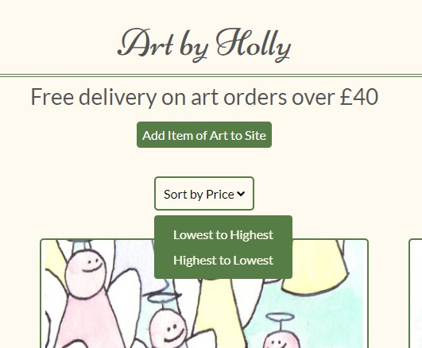
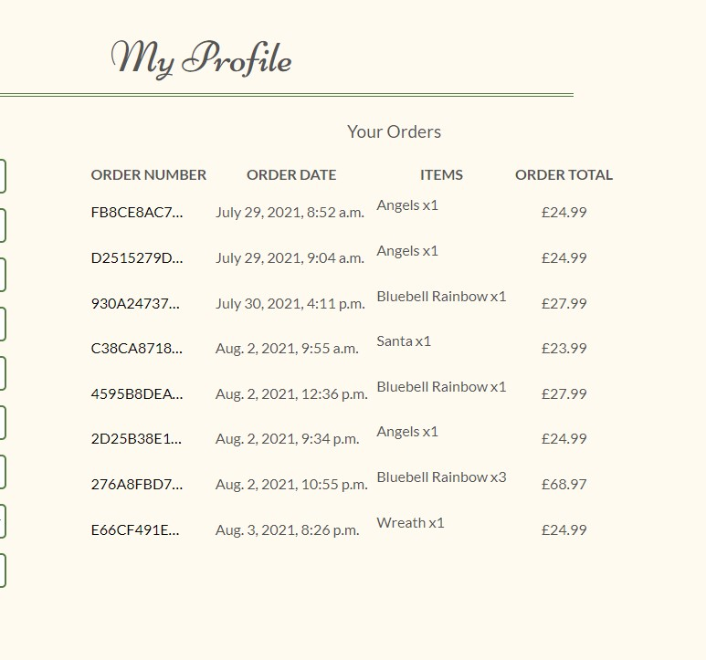
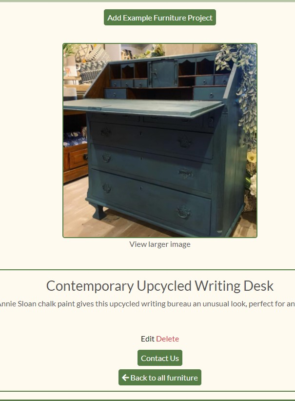
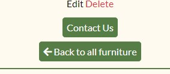
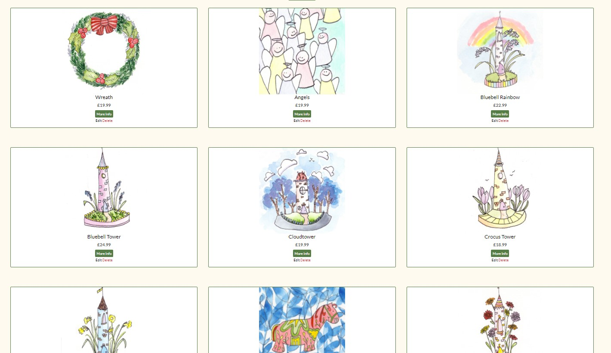
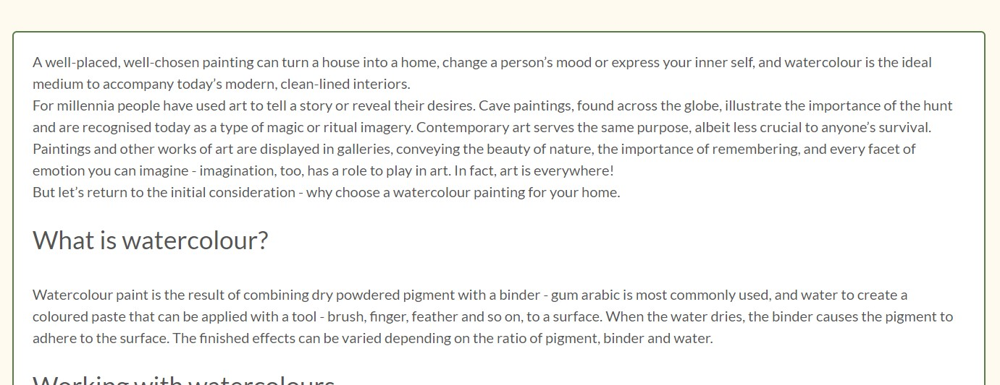
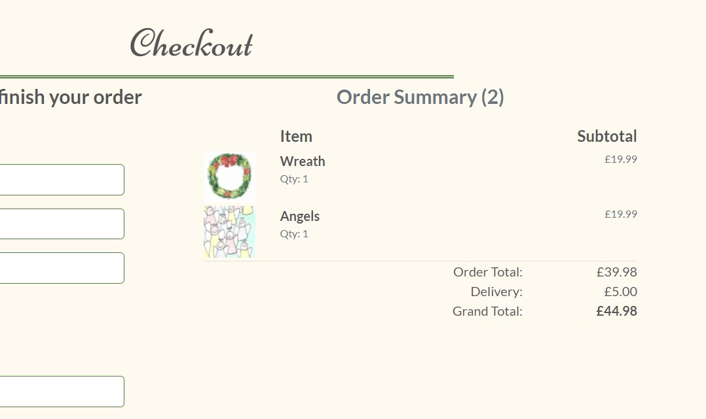
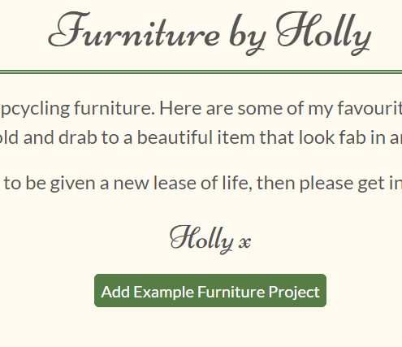

# **Testing**

## **Bugs**

* **Issue**

    Buttons were not aligning on some of the allauth templates

    **Fix**
    
    Found to be an issue with getting the home button aligning with the input on some of the pages. Additional CSS class written to change the home button CSS when it was paired with an input instead of a button

  ---

* **Issue**
    
    Toasts were not displaying on anything other than the basket page

    **Fix**
    
    {{ block.super }} was missed off the templates. The BTT JS was overriding the base template JS so the toasts could not be displayed

  ---

*   **Issue**
    
    Having worked properly previously, the sign up form boxes were now very small. 

    **Fix**
    
    From inspecting the front end, it turned out that the sign up form and quantity picker shared a class name. Once the quanitity picker size had been amended for smaller screens, this affected the sign up form. I changed the class name on the quantity picker so they could now be styled independently

  ---

*   **Issue**
    
    The cards on the art, furniture and blog pages overapped. This caused the buttons on those cards to not function. Chnging the CSS on these cards did not affect the margin.

    **Fix**
    
    Once the card size was amended from h-100 to h-90 the issue was resolved.
  ---
*   **Issue**
    
    Sort function in Blogs home page caused account dropdown to show

    **Fix**
    
    Found missing container-fluid div, problem solved once opening div added
  
  ---
 **Unfixed Bugs**
*   **Issue**

    On Firefox the social media icons in the footer do not align correctly. However as only 3.45% of people worldwide use firefox as their web browser, and as the issue is a cosmetic one and does not affect the functionality of the site, I have not prioritised fixing this.

---

## **Manual User testing**

* Testing has been undertaken on devices down to 320px.

#### App - Home
* #### Homepage
    * **When logged in**
        

    * **When not logged in** 

    * **When logged in as a superuser**
        

* #### **Contact Page**
    * 
   
#### App - Art

* #### **Art Home Page**
    * 

* #### **Art Detail Page**
    * 

* #### **Add Art Page**
    * 

* #### **Edit Art Page**
    * 

* #### **Delete Art Page**
    * 

#### App - Furniture

* #### **Furniture Home Page**
    * 

* #### **Furniture Detail Page**
    * 

* #### **Add Furniture Page**
    * 

* #### **Edit Furniture Page**
    * 

* #### **Delete Furniture Page**
    * 
    

#### App - Blog

* #### **Blog Home Page**
    * 

* #### **Blog Detail Page**
    * 

* #### **Add Blog Page**
    * 

* #### **Edit Blog Page**
    * 

* #### **Delete Blog Page**
    * 
 

   

 

---
    
 ## **Code Validator**

The HTML and CSS were tested using W3C Markup Validator and W3C CSS Validator to ensure that there 
were no syntax errors on any of the pages of the project. The python was checked against Git pod's internal PEP8 checker, and double checked using PEP8 Online.

* [W3C Markup Validator]()
* [W3C CSS Validator](https://jigsaw.w3.org/css-validator/validator)
* [PEP8 Checker](http://pep8online.com/)

Each page of HTML and the CSS file were all checked. All results came back as completely clear of errors.

* **Results**
    * HTML
        * 

        
    
        

      
    * [CSS]()

    * [Python]()

---

### **Testing User Stories from User Experience (UX) Section**

* **User Stories** 
    * **As a customer looking for new art**
        1. I want to be able to look through Holly's art to see her style
        * The art home page enables people to browse her work on one page. This will give people chance to see her style and decide if they want to look into her work further.

        2. I want to be able to sort the art by price to be able to shop to my budget
        * The sort feature on the main art page enables customers to sort art by price, either high to low or low to high.
        
        3. I want to be able to register an account so that my default information can be saved for future purchases
        * Once a user registers an account on the site, they will be able to save their delivery details to save entering them on future purchases.
        4. I want to be able to see my previous purchases
        * Once a user registers an account, their previous purchase history will be available from their profile page.
        
        

    * **As a customer looking for someone to upcycle their furniture**
        1. I want to be able to see Holly's previous work to get ideas and to see the quality of her work
        * The furniture home page shows examples of Holly's previous furniture restoration projects so that they can see the kind of work that she does, and also get some inspiration for their own potential projects.
        
        2. I want to be able to contact Holly in order to discuss the project and get a quote
        * The contact page enables people to send messages to the artist in order to get information and to contact her to discuss a furniture restoration project.
        
    
    * **As someone interested in art**
        1. I want to be able to see the work that Holly does in order to learn more about her style
        * Although the site is set up as an ecommerce site, the artwork is available online for everyone to see and enjoy. 
        

        2. I want to be able to learn more through reading the blogs on the site. 
        * The art blogs on the site give information on different areas of art enabling users to reach the site either through looking for art, or an interest in the topics in the blog section.
        

    * **As the owner of the store**
        1. I want to be able to sell my art through the site
        * The art pages and checkout page allows customers to purchase the artwork on the site.
        

        2. I want to be able to upload new pieces to the site, edit the existing ones, and delete any that are no longer available
        * Once the store owner is logged in as a superuser, they will be able to add new art, and edit the pieces that are already uploaded. If the piece is no longer available, the store owner can then delete the piece from the database. 
        

        3. I want to be able to showcase my previous upcycling projects
        * The furniture home page will display some of the artist's previous restoration projects to show their talent and style. 
        4. I want to be able to upload new furniture projects to the site, edit the existing ones, and delete any that I no longer want to feature
        * Once the store owner is logged in as a superuser, they will be able to add new example furniture restoration projects, and edit the ones that are already uploaded. If the artist no longer wants to showcase that project, they can then delete the piece from the database. 
        

        5. I want people to be able to contact me for information about my art or furniture projects
        * The contact page will send an email direct to the artist's email address if any customers wish to get in touch.
        6. I want to be able to share my love of art though my blog
        * The blog will enable the artist to talk about the theoretical side of art and share topics that are of interest to her with site users.
### **Further Testing**

* The Website was tested on:
    * Google Chrome 
    * Internet Explorer 
    * Microsoft Edge w
    * Firefox 
    * Safari 

* The website was viewed on a variety of devices such as 
   * Laptop 
   * iPhone7 
   * iPhone 11 
   * iPhoneX
   * Oppo A9
   * Huawei p20 pro

* Friends were asked to review the site on different devices, screenshot any issues and point out any bugs or 
user experience issues.

---

Testing on checkout page. If user closes the page before form has been submitted but after the payment has been confirmed, the order will be created in the webhook. This was tested through commenting out the form submission to emulate a customer who closes the page before the form was submitted

testing on add_product page

if invalid form is entered (tested through adding invalid price) - error message pops up advising user to correct the price

testing on edit_product page

invlaid form is entered (tested through adding invalid price) - error message pops up advising user to correct the price