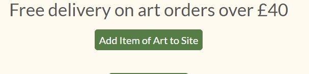

# **Testing**

## **Bugs**

* **Issue**

    Buttons were not aligning on some of the allauth templates

    **Fix**
    
    Found to be an issue with getting the home button aligning with the input on some of the pages. Additional CSS class written to change the home button CSS when it was paired with an input instead of a button

  ---

* **Issue**
    
    Toasts were not displaying on anything other than the basket page

    **Fix**
    
    {{ block.super }} was missed off the templates. The BTT JS was overriding the base template JS so the toasts could not be displayed

  ---

*   **Issue**
    
    Having worked properly previously, the sign up form boxes were now very small. 

    **Fix**
    
    From inspecting the front end, it turned out that the sign up form and quantity picker shared a class name. Once the quanitity picker size had been amended for smaller screens, this affected the sign up form. I changed the class name on the quantity picker so they could now be styled independently

  ---

*   **Issue**
    
    The cards on the art, furniture and blog pages overapped. This caused the buttons on those cards to not function. Chnging the CSS on these cards did not affect the margin.

    **Fix**
    
    Once the card size was amended from h-100 to h-90 the issue was resolved.
  ---
  
*   **Issue**
    
    Sort function in Blogs home page caused account dropdown to show

    **Fix**
    
    Found missing container-fluid div, problem solved once opening div added
  
  ---

  *   **Issue**
    Adding a piece of art with no image results in an error page. 

    **Fix**
    
    The placement of the "View larger image" link was causing the error. Moved inside the if statement, issue resolved.

---

  *   **Issue**
    Increment and decrement buttons were making the quantity select button reder poorly on smaller screens

    **Fix**
    
    Added code to CSS to remove the - + buttons on medium and smaller screen sizes. It was also felt that they were not necessary on smaller screen sizes 

---

  *   **Issue**
    On firefox, the 3 footer links were not aligned. This was only an issue on firefox and no other browser.

    **Fix**
    
    A stray mt-3 tag had been left in the instagram link in the footer. This was only changing the margin on the firefoc and no other browser. Once this was removed they lined up on all browsers.

---

  *   **Issue**
    Error pages would not load

    **Fix**
    
    I had made a mistake in the templates for the error pages and used the link <a class="error-link" href="{{ url ('home') }}">Go back to the home page</a> instead of <a class="error-link" href="">Go back to the home page</a>

---

## **Manual User testing**

* Testing has been undertaken on devices down to 320px.

Throughout the project, testing was consistently undertaken on each feature that was added to the site, and any layout changes were checked on all devices to ensure the site was optimised for all screen sizes.

#### App - Home
* #### Homepage
    * **When logged in**
        
        My Account drop down shows My Profile and Logout links

    * **When not logged in** 

        My account drop down shows Register and Login links
    
    * **General**

        Home page, header and footer work for all screen sizes down to 320px
        
* #### Login Page
    * Login page enables a customer to log in to the store. 
    * If the customer does not have an account then they can follow the register link to register an account.
    * Once logged in, a toast pops up to say that login was successful. If they have something in their basket then the toast shows a summary of the basket contents in the toast.

* #### **Contact Page**
    * All fields on the form need to be filled in for the form to submit. If the form is submitted without one of the fields completed, an error message pops up.
    * If an invalid email address is entered, an error message pops up
    * Hitting cancel after completing the form takes the user back to the homepage.
    * Successfully submitting the contact form renders a message sent page with a link to return tp the home page.

   
#### App - Art

* #### **Art Home Page**
    * The sort by price button works to sort the artwork in both ascending and descending order.
    * All links on the cards work and take the user to the correct art detail page. 
    * Page renders well on all screen sizes
    * If user is superuser, "Add item of art" button is displayed

* #### **Art Detail Page**
    * Correct image and details show on each page. 
    * Back to art page enables user to return to the all art page to keep browsing.
    * Quantity selector box works to change the number of pieces that are added to the basket. 
    * Clicking add to basket adds the selected number of pieces to the basket and a toast pops up to advise of the addition to the basket.
    * Clicking the view larger image link opens the full sized image in an new tab

* #### **Add Art Page**
    * if invalid form is entered (tested through adding invalid price) - error message pops up advising user to correct the price
    * New art cannot be added to the site if all required fields are not completed in the form.
    * Successfully adding new art adds the piece to the database and routes the user to the art detail page for the artwork they have uploaded.

* #### **Edit Art Page**
    * If invalid form is entered (tested through adding invalid price) - error message pops up advising user to correct the price
    * Art cannot be edited if all required fields are not completed in the form.
    * Successfully editing art edits the piece in the database and routes the user to the art detail page for the artwork they have edited.

* #### **Delete Art Page**
    * Art can be deleted from either the art home page or the art detail page. 
    * Once deleted the user is routed back to the art home page.

#### App - Furniture

* #### **Furniture Home Page**
    * If user is superuser, "Add example furniture project" button is displayed as well as edit and delete links.
    * All links on the example furniture page work and take the user to the furniture detail page
    * Page renders well on all screen sizes
    * If user is superuser, "Add item of furniture" button is displayed

* #### **Furniture Detail Page**
    * Contact us button links user to the contact form.
    * Back to all furniture button works to return user to all furniture page
    * Edit and delete links are displayed if logged in user is a superuser
    * Clicking View larger image link opens the full size image in a new tab.

* #### **Add Furniture Page**
    * New furniture cannot be added to the site if all required fields are not completed in the form.
    * Successfully adding a new item of furniture adds the piece to the database and routes the user to the furniture detail page for the piece they have uploaded.

* #### **Edit Furniture Page**
    * Furniture example cannot be edited if all required fields are not completed in the form.
    * Successfully editing furniture edits the piece in the database and routes the user to the furniture detail page for the piece they have edited.

* #### **Delete Furniture Page**
    * Furniture can be deleted from either the furniture home page or the furniture detail page. 
    * Once deleted the user is routed back to the furniture home page.
    

#### App - Blog

* #### **Blog Home Page**
    * Page renders well in all screen sizes. The cards end up different sizes due to the differing amount of content in them, however this was preferred over having a varied amount of white space which would have been necessary if the cards were to be all the same size.
    * If logged in user is a super user, Add new blog button and edit and delete links are displayed
    * Read more button takes user to the correct blog page

* #### **Blog Detail Page**
    * Blog renders well on all screen sizes
    * Back to all blogs button returns user to the blog home page
    * If logged in user is a super user, Add new blog button and edit and delete links are displayed

* #### **Add Blog Page**
    * New blogs cannot be added to the site if all required fields are not completed in the form.
    * Successfully adding a new blog adds it to the database and routes the user to the blog page that they have uploaded.

* #### **Edit Blog Page**
    * Blog cannot be edited if all required fields are not completed in the form.
    * Successfully editing the blog edits the piece in the database and routes the user to the blog page that they have edited.

* #### **Delete Blog Page**
    * Blog can be deleted from either the blog home page or the blog detail page. 
    * Once deleted the user is routed back to the blog home page.

#### App - Basket
    * Items in basket correctly show on basket page
    * If total is under £40, a delivery charge is added to the total and a message is displayed telling the user how much more they need to add to get free delivery
    * Quantity picker correctly updates the basket, remve link works to remove item from basket
    * Keep shopping link returns user to art page
    * Secure Checkout link takes user to checkout page
 
#### App - Checkout

* #### **Checkout Page**
    * If user closes the page before form has been submitted but after the payment has been confirmed, the order will be created in the webhook. This was tested through commenting out the form submission to emulate a customer who closes the page before the form was submitted
    * If user is logged in and has saved their details, these are prefilled in the customer details and delivery information form
    * Order summary correctly shows on page
    * When order is completed, user is routed to the checkout success page

* #### **Checkout Success Page**    
    * Page renders showing corrent order information
    * Home button returns user to the home page

#### App - Profile
    * Profile page shows the users default delivery information
    * Update delivery address button works correctly to update the users stored information
    * Previous orders are recorded on the screen, order number acts as a link to the previous order confirmation
---
    
 ## **Code Validator**

The HTML and CSS were tested using W3C Markup Validator and W3C CSS Validator to ensure that there 
were no syntax errors on any of the pages of the project. The python was checked against Git pod's internal PEP8 checker, and double checked using PEP8 Online.

* [W3C Markup Validator]()
* [W3C CSS Validator](https://jigsaw.w3.org/css-validator/validator)
* [PEP8 Checker](http://pep8online.com/)

Each page of HTML and the CSS file were all checked. All CSS results came back completely clear of errors.
The HTML have some reported errors that have not been resolved.

* "An img element must have an alt attribute, except under certain conditions." This error is on the page to edit the blog, furniture and artwork pages, The image is not written on this page and is taken from the detail pages where the alt tags are in place.

* **Results**
    * HTML
        * [Home](https://github.com/Rachel2308/from-field-to-frame/blob/master/html-checker-index.pdf)
        * [Contact](https://github.com/Rachel2308/from-field-to-frame/blob/master/html-checker-contact.pdf)
        * [Login](https://github.com/Rachel2308/from-field-to-frame/blob/master/html-checker-login.pdf)
        * [Register](https://github.com/Rachel2308/from-field-to-frame/blob/master/html-checker-register.pdf)
        * [All Art](https://github.com/Rachel2308/from-field-to-frame/blob/master/html-checker-all-art-2.pdf)
        * [Art Detail](https://github.com/Rachel2308/from-field-to-frame/blob/master/html-checker-art-detail-2.pdf)
        * [Add Art](https://github.com/Rachel2308/from-field-to-frame/blob/master/html-checker-add-art-2.pdf)
        * [Edit Art](https://github.com/Rachel2308/from-field-to-frame/blob/master/html-checker-edit-art-2.pdf)
        * [All Furniture](https://github.com/Rachel2308/from-field-to-frame/blob/master/html-checker-furniture-2.pdf)
        * [Furniture Detail](https://github.com/Rachel2308/from-field-to-frame/blob/master/html-checker-furniture-detail-2.pdf)
        * [Add Furniture](https://github.com/Rachel2308/from-field-to-frame/blob/master/html-checker-add-furniture-2.pdf)
        * [Edit Furniture](https://github.com/Rachel2308/from-field-to-frame/blob/master/html-checker-furniture-edit-2.pdf)
        * [All Blogs](https://github.com/Rachel2308/from-field-to-frame/blob/master/html-checker-blogs-2.pdf)
        * [Blog Detail](https://github.com/Rachel2308/from-field-to-frame/blob/master/html-checker-blog-detail-2.pdf)
        * [Add Blogs](https://github.com/Rachel2308/from-field-to-frame/blob/master/html-checker-add-blog-2.pdf)
        * [Edit Blogs](https://github.com/Rachel2308/from-field-to-frame/blob/master/html-checker-edit-blog-2.pdf)
        * [Profile Page](https://github.com/Rachel2308/from-field-to-frame/blob/master/html-checker-profile.pdf)
        * [Basket empty](https://github.com/Rachel2308/from-field-to-frame/blob/master/html-checker-basket-empty.pdf)
        * [Basket with products](https://github.com/Rachel2308/from-field-to-frame/blob/master/html-checker-basket-products.pdf)
        * [Checkout](https://github.com/Rachel2308/from-field-to-frame/blob/master/html-checker-checkout.pdf)
        * [Checkout Success](https://github.com/Rachel2308/from-field-to-frame/blob/master/html-checker-checkout-success.pdf)

              
    * CSS
        * [Base](https://github.com/Rachel2308/from-field-to-frame/blob/master/css-checker-base.pdf)
        * [Checkout](https://github.com/Rachel2308/from-field-to-frame/blob/master/css-checker-checkout.pdf)
        * [Profile](https://github.com/Rachel2308/from-field-to-frame/blob/master/css-checker-profile.pdf)

    * Python
        All linting errors have been fixed using PEP8 Online apart from the following:
        
        * Blog - widgets.py has one line which could not be shortened with making the code illegible
        * Checkout - webhooks.py has one line which could not be shortened
        * Furniture widget.py has one line cannot be shortened

---
### **Testing General UX Expectations**

* The site is consistant throughout the site, with the same styling of borders and buttons.
* The colour scheme is used throughout the site, ensuring consistency on each page
* The nav bar and footer are the same across all pages.
* The site is easy to navigate with clearly labelled links and a simple design, enabling the art to be the primary focus.
* The site adapts well to all screen sizes
* The site uses allauth to provide a robust account system, while stripe is used to ensure payments made through the site are secure

### **Testing User Stories from User Experience (UX) Section**

* **User Stories** 
    * **As a customer looking for new art**
        1. I want to be able to look through Holly's art to see her style
        * The art home page enables people to browse her work on one page. This will give people chance to see her style and decide if they want to look into her work further.
        2. I want to be able to sort the art by price to be able to shop to my budget
        * The sort feature on the main art page enables customers to sort art by price, either high to low or low to high.
        
        3. I want to be able to register an account so that my default information can be saved for future purchases
        * Once a user registers an account on the site, they will be able to save their delivery details to save entering them on future purchases.
        4. I want to be able to see my previous purchases
        * Once a user registers an account, their previous purchase history will be available from their profile page.
        
        

    * **As a customer looking for someone to upcycle their furniture**
        1. I want to be able to see Holly's previous work to get ideas and to see the quality of her work
        * The furniture home page shows examples of Holly's previous furniture restoration projects so that they can see the kind of work that she does, and also get some inspiration for their own potential projects.
        
        2. I want to be able to contact Holly in order to discuss the project and get a quote
        * The contact page enables people to send messages to the artist in order to get information and to contact her to discuss a furniture restoration project.
        
    
    * **As someone interested in art**
        1. I want to be able to see the work that Holly does in order to learn more about her style
        * Although the site is set up as an ecommerce site, the artwork is available online for everyone to see and enjoy. 
        

        2. I want to be able to learn more through reading the blogs on the site. 
        * The art blogs on the site give information on different areas of art enabling users to reach the site either through looking for art, or an interest in the topics in the blog section.
        

    * **As the owner of the store**
        1. I want to be able to sell my art through the site
        * The art pages and checkout page allows customers to purchase the artwork on the site.
        

        2. I want to be able to upload new pieces to the site, edit the existing ones, and delete any that are no longer available
        * Once the store owner is logged in as a superuser, they will be able to add new art, and edit the pieces that are already uploaded. If the piece is no longer available, the store owner can then delete the piece from the database. 
        

        3. I want to be able to showcase my previous upcycling projects
        * The furniture home page will display some of the artist's previous restoration projects to show their talent and style. 
        4. I want to be able to upload new furniture projects to the site, edit the existing ones, and delete any that I no longer want to feature
        * Once the store owner is logged in as a superuser, they will be able to add new example furniture restoration projects, and edit the ones that are already uploaded. If the artist no longer wants to showcase that project, they can then delete the piece from the database. 
        

        5. I want people to be able to contact me for information about my art or furniture projects
        * The contact page will send an email direct to the artist's email address if any customers wish to get in touch.
        6. I want to be able to share my love of art though my blog
        * The blog will enable the artist to talk about the theoretical side of art and share topics that are of interest to her with site users.
### **Further Testing**

* The Website was tested on:
    * Google Chrome 
    * Internet Explorer 
    * Microsoft Edge w
    * Firefox 
    * Safari 

* The website was viewed on a variety of devices such as 
   * Laptop 
   * iPhone7 
   * iPhone 11 
   * iPhoneX
   * Oppo A9
   * Huawei p20 pro

* Friends were asked to review the site on different devices, screenshot any issues and point out any bugs or 
user experience issues.

---

